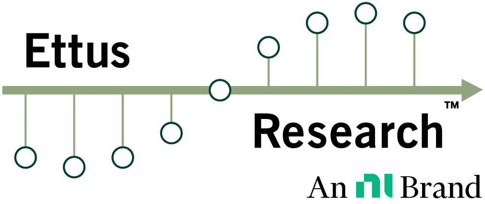

<table width="100%">
  <tr>
    <td align="left" valign="middle" width="50%">
      
    </td>
    <td align="right" valign="middle" width="50%">
      
    </td>
  </tr>
</table>

---
# RFNoC Block Aurora

##### **_Table of contents_**
- [Features](#features)
- [Getting Started with the Aurora RFNoC Block](#getting-started-with-the-aurora-rfnoc-block)
  - [Pre-requisites](#pre-requisites)
  - [Usage](#usage)
    - [RX streaming](#rx-streaming)
    - [TX streaming](#tx-streaming)
  - [Data Format across the Aurora link](#data-format-across-the-aurora-link)
- [Additional Resources](#additional-resources)

## Features
- **High Throughput**: The 64b/66b Aurora protocol allows for high throughput data streaming,
without the limitations and performance requirements of Ethernet-based UDP streaming.
- **Low Latency**: Aurora provides low latency communication between the USRP
  and the connected devices due to its use of the point-to-point Aurora link layer protocol.
- **Low Level Access to RFNoC**: The Aurora RFNoC block provides low level access 
  to the RFNoC framework, allowing users to directly access the USRP's RFNoC blocks and
  data streams using the CHDR protocol.
- **Interoperability**: The Aurora RFNoC block is designed to be interoperable with
  other Aurora capable devices, allowing users to connect their USRP to a wide range of
  high performance compute nodes and devices. These devices do not have to be UHD
  compatible, as long as they support the Aurora 64B66B protocol.

## Getting Started with the Aurora RFNoC Block
This is a short guide to get you started with the Aurora RFNoC block.
For more detailed information on the Aurora RFNoC block, please refer to the full
[Aurora RFNoC Block User Manual](docs/RFNoC_block_Aurora_manual.md).

> [!NOTE]
> This is an advanced RFNoC block that requires a basic understanding of
> the RFNoC framework, the UHD API and the CHDR Protocol. Additionally, if streaming
> to or from non-USRP devices, the user has to provide the Aurora 64B/66B protocol
> implementation on the remote compute node, which may require additional HDL expertise.

### Pre-requisites
- **UHD Version**: Install UHD version 4.9 or later.
- **FPGA Image**: The Aurora RFNoC block needs to be included in the FPGA image.
  You can use the `rfnoc_image_builder` to build FPGA images from the following image core
  .yml files:
    - [x410_200_2xAurora100Gbps_rfnoc_image_core.yml](../../../../icores/x410_200_2xAurora100Gbps_rfnoc_image_core.yml)
    - [x410_X1_200_Aurora100Gbps_rfnoc_image_core.yml](../../../../icores/x410_X1_200_Aurora100Gbps_rfnoc_image_core.yml)

### Usage
Here are some short Python RFNoC API code snippets to show the general usage of
the Aurora RFNoC block for very basic remote RX and TX streaming applications.

The code snippets are meant to illustrate the basic concepts of interfacing with the
Aurora RFNoC block. They are not complete applications and do not include error handling,
data processing or other application logic. For a complete application examples, see
[examples/aurora_loopback_host.py](../../../../examples/aurora_loopback_host.py) and
[examples/aurora_loopback_nullsrcsink.py](../../../../examples/aurora_loopback_nullsrcsink.py).

#### RX streaming
1. Open UHD RFNoC session to USRP device from a UHD host system.
```python
# Get reference to USRP RFNoC graph
graph = uhd.rfnoc.RFNoCGraph("addr=<usrp_ip_address>")
```

2. Get Reference to an Aurora RFNoC block controller.
```python
# Get reference to Aurora RFNoC block controller
aurora_block = graph.get_block(graph.find_blocks("Aurora")[0])
```

3. Connect Radio RX outputs to Aurora block inputs.
```python
# Connect Radio -> Aurora block
uhd.rfnoc.connect_through_blocks(graph, radio.get_unique_id(), 0, aurora_block.get_unique_id(), 0)
...
...
...
# Commit the graph to apply the changes
graph.commit()
```

4. Configure radio for RX streaming.
```python
# Configure Rx frequency and potential other parameters
radio.set_rx_frequency(2.5e9, 0)
...
```

5. Start capturing data on the radios and stream data to the Aurora block.
```python
stream_cmd = uhd.types.StreamCMD(uhd.types.StreamMode.start_cont)
radio.issue_stream_cmd(stream_cmd)
```

6. Receive data on the Compute node via the Aurora link.

#### TX streaming
1. Open UHD RFNoC session to USRP device from a UHD host system.
```python
# Get reference to USRP RFNoC graph
graph = uhd.rfnoc.RFNoCGraph("addr=<usrp_ip_address>")
```

2. Get Reference to an Aurora RFNoC block controller.
```python
# Get reference to Aurora RFNoC block controller
aurora_block = graph.get_block(graph.find_blocks("Aurora")[0])
```

3. Connect Aurora block outputs to Radio TX inputs.
```python
# Connect Aurora block -> Radio
uhd.rfnoc.connect_through_blocks(graph, aurora_block.get_unique_id(), 0, radio.get_unique_id(), 0)
...
...
...
# Commit the graph to apply the changes
graph.commit()
```

4. Configure radio for TX streaming.
```python
# Configure Tx frequency and potential other parameters
radio.set_tx_frequency(2.5e9, 0)
...
```

5. Configure the Aurora block to forward CHDR data coming in from the Aurora link
```python
# Set the CHDR data forwarding mode
aurora_block.tx_datapath_enable(True)
```

6. Start streaming CHDR data packets to Aurora link on the compute Node.


The Aurora RFNoC block can be used in custom UHD applications using the Aurora
Block Controller RFNoC API.

A complete list and description of all available functions of the Aurora Block controller
API can be found in 
[aurora_block_control.hpp](../../../../include/rfnoc/oot-blocks/aurora_block_control.hpp).

For an example of how to use the Aurora RFNoC block in a custom UHD application
using the RFNoC Python API, please refer to the
[UHD RFNoC Aurora Example](../../../../examples/aurora_loopback_host.py)


### Data Format across the Aurora link
The Aurora RFNoC block uses the CHDR protocol for data streaming over the Aurora link.
The bus width of the aurora link is fixed at 256 bits, due to the 4 Aurora 64B/66B lanes
used in the Aurora RFNoC block. Therefore, the CHDR packets sent over the Aurora link
are formatted to fit into the 256-bit bus width using the `CHDR_W = 256` format.

Each packet sent over the Aurora link must start with a header word, that consists
of the following components (see
[RFNoC Specification - Table 6](https://files.ettus.com/app_notes/RFNoC_Specification.pdf)):

|Reserved|Timestamp|CHDR Header|
|:---:|:---:|:---:|
| 128 bits | 64 bits | 64 bits |


The CHDR header consists of the following fields (see
[RFNoC Specification - Table 1](https://files.ettus.com/app_notes/RFNoC_Specification.pdf)):

|VC|EOB|EOV|PktType|NumMData|SeqNum|Length|DstEPID|
|:---:|:---:|:---:|:---:|:---:|:---:|:---:|:---:|
| 6 bits | 1 bit | 1 bit | 3 bits | 5 bits | 16 bits | 16 bits | 16 bits |
 
For more details on the CHDR data format, please refer to the
[RFNoC Specification](https://files.ettus.com/app_notes/RFNoC_Specification.pdf).

## Additional Resources
- [RFNoC Block Aurora documentation manual](docs/RFNoC_block_Aurora_manual.md)
- [RFNoC Specification](https://files.ettus.com/app_notes/RFNoC_Specification.pdf)
- [Aurora 64B66B Protocol Specification SP11](https://docs.amd.com/v/u/en-US/aurora_64b66b_protocol_spec_sp011)

