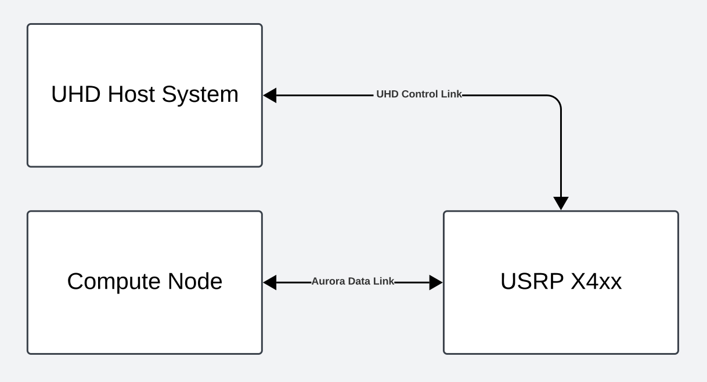
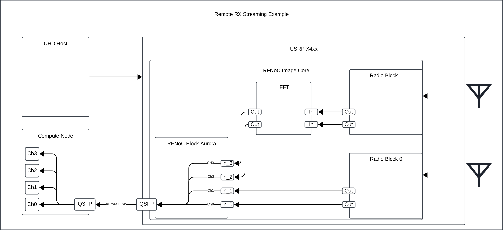
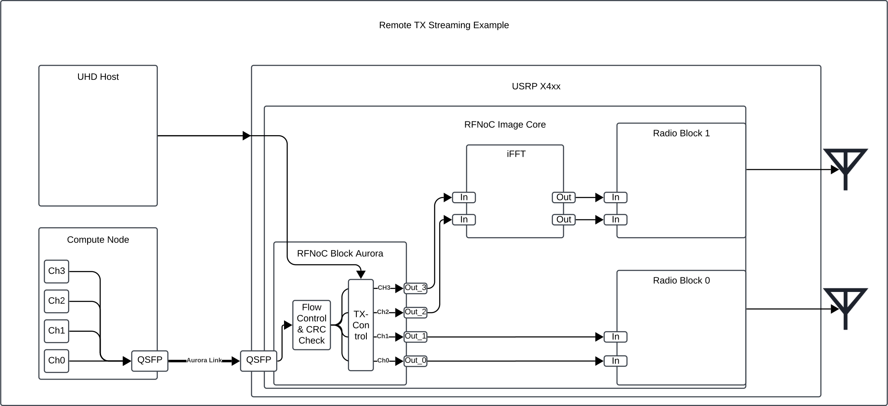
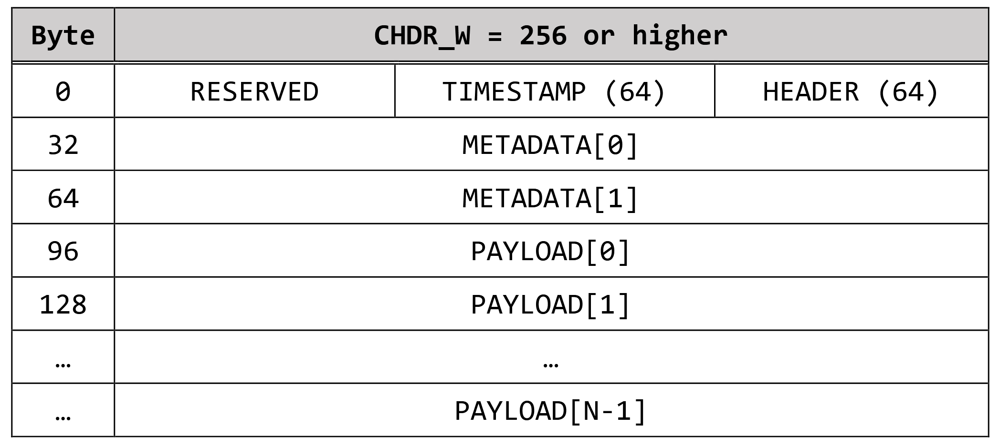
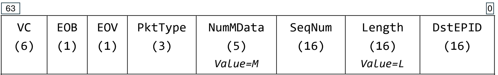
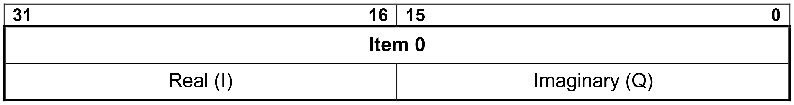
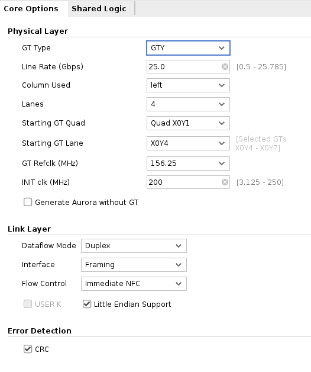

<table width="100%">
  <tr>
    <td align="left" valign="middle" width="50%">
      
    </td>
    <td align="right" valign="middle" width="50%">
      
    </td>
  </tr>
</table>

---
# Aurora RFNoC Block User Manual
---
## Table of Contents
- [Overview](#overview)
- [Theory of Operation](#theory-of-operation)
  - [Aurora Remote Data Streaming](#aurora-remote-data-streaming)
  - [Remote RX Streaming](#streaming-data-from-the-usrp-to-a-remote-compute-node)
  - [Remote TX Streaming](#streaming-data-from-a-remote-compute-node-to-the-usrp)
    - [Timed vs Non-timed Streaming](#timed-vs-non-timed-streaming)
    - [Data Forwarding Control](#data-forwarding-control)
  - [Multiplexing Data Streams for Transmission over the Aurora Link](#multiplexing-data-streams-for-transmission-over-the-aurora-link)
  - [CHDR Data Format on the Aurora Link](#chdr-data-format-on-the-aurora-link)
    - [CHDR Data Bursts](#chdr-data-bursts)
  - [Compute Node to USRP Flow Control Mechanism](#compute-node-to-usrp-flow-control-mechanism)
    - [Flow Control Modes](#flow-control-modes)
    - [Adjusting Flow Control Parameters](#adjusting-flow-control-parameters)
- [FPGA Implementation Details](#fpga-implementation-details)
  - [Aurora link configuration](#aurora-link-configuration)
    - [Internal Aurora Link statistics](#internal-aurora-link-statistics)
- [Integrating Aurora RFNoC Block in a Custom FPGA Image](#integrating-aurora-rfnoc-block-in-a-custom-fpga-image)
  - [RFNoC Block HDL configuration parameters](#rfnoc-block-hdl-configuration-parameters)
  - [Integration Steps](#integration-steps)
- [Troubleshooting / FAQ](#troubleshooting--faq)


## Overview

The Aurora RFNoC block provides an alternative way of connecting an X4xx USRP to
non-UHD devices using the Aurora transport protocol. It has been designed to enable
remote RX and TX streaming via the QSFP28 ports, to provide users with an alternative
to the existing Ethernet based UDP remote streaming. The Aurora RFNoC block can enable
users to directly connect their Aurora capable high performance compute nodes to the USRP,
in order to enable high throughput data streaming to and from the USRP.

## Theory of Operation

The Aurora RFNoC block can be used to connect a USRP device to a remote compute node
that supports the Aurora 64B/66B protocol. This allows users to stream data from the
USRP to the remote compute node through an Aurora link, and vice versa.

The intended use case for this block is to enable remote RX and TX IQ data streaming.
The data protocol used for the data streaming is the CHDR protocol, which is also the
protocol used by the RFNoC framework internally to enable communication between
the USRP's RFNoC blocks and the UHD host.


### Aurora remote data streaming



The Aurora RFNoC block is designed to stream data over the Aurora link to a remote setup.
Remote data streaming in the UHD context is defined as the scenario where the USRP is
controlled by a UHD host system, but the data flow is going over a separate data link
that can be part of a different setup/network than the UHD control link/session (see also
[Ethernet Remote Streaming](https://files.ettus.com/manual/page_stream.html#stream_remote)).

### Streaming data from the USRP to a remote compute node

The following diagram illustrates a possible method of streaming data from the USRP to a remote
compute node using the Aurora RFNoC block:



In this use case, the USRP is taking data coming in on the input ports of 
the Aurora RFNoC block, and then streaming it over the Aurora link to a remote 
compute node that is connected to the USRP via the QSFP28 ports. For example,
the USRP can be receiving IQ data from the radio blocks, or from other RFNoC blocks
that are connected to the Aurora RFNoC block's input ports and then forward
this data to the remote compute node via the Aurora link. 
The remote compute node can then process the received data and perform further
computations as necessary.

For this use case, the Aurora block implements the following functionality:

1. Receive the CHDR packets on its input ports.
2. Tag each packets CHDR header `VC` field depending on the input port it was received on.
3. Resize the CHDR packets from the RFNoC bus width (`CHDR_W`) to the Aurora link
bus width (256 bits).
4. Multiplex all data packet streams into a single data stream.
5. Send the multiplexed data stream out via the Aurora link to the remote compute node.

Packets are immediately forwarded over the Aurora link upon receiving the word
of an incoming CHDR packet. There are no additional mechanisms in place to control
the data flow through the Aurora link from the host in this streaming use case.

The remote compute node is responsible for receiving the data packets and
processing them as needed, as well as generating and sending out any NFC flow control
messages that might be needed to prevent data loss due to overflows on the remote
compute node side. The flow control message handling is handled internally by the
Aurora IP core, and will result in the Aurora link interface indicating it is not
ready to receive more data packets while flow control is active.

Regarding timed versus non-timed streaming, the Aurora RFNoC block is agnostic and
will forward all packets it receives on its input ports to the Aurora link as is.
If the packets are not timed (i.e. `PktType == 0x6`), the Aurora RFNoC block will
forward them as is without any timestamps.
If the packets coming in on the input ports are timed packets with a timestamp
(i.e. `PktType == 0x7`), the Aurora RFNoC block will forward them as such. 

### Streaming data from a remote compute node to the USRP

The following diagram illustrates a possible method of streaming data from the remote
compute node to the USRP using the Aurora RFNoC block:



The Aurora RFNoC block supports both streaming data to and from the remote compute node
over the Aurora link concurrently.

Data packets coming in on the Aurora link are forwarded via the output ports of 
the Aurora RFNoC block to the respective connected RFNoC blocks.

For example, the Aurora block can be used to stream IQ samples to the USRP radio blocks.
In this scenario, the remote compute node will generate and send IQ data to the USRP via the Aurora
link. The Aurora block will then forward the received data packets on its output ports.
Connecting the block output ports directly or indirectly to the radio blocks of the USRP
will result in RF IQ data transmission.

For the TX streaming use case, the Aurora RFNoC block is responsible for:
1. Receiving the CHDR packets from the Aurora link.
2. Checking the CRC checksum of the packets to ensure data integrity.
3. Providing flow control to prevent data loss due to overflows as well as back
pressure through the Aurora link.
4. De-multiplexing the received data packets from the Aurora link into output
port streams, based on the `VC` field of the CHDR header.
5. Resizing the CHDR packets from the Aurora link bus width (256 bits) to the
RFNoC bus width (`CHDR_W`).
6. Controlling the TX data flow to the output ports, e.g. enabling or disabling
data forwarding, setting the packet drop policy, etc. .

For the data integrity checks and flow control, the Aurora RFNoC block uses the
built in CRC checksum and Native Flow Control (NFC) of the Aurora 64B/66B protocol
to ensure the integrity of the data packets. 

For these to operate correctly, the remote compute node must also implement the
Aurora 64B/66B protocol correctly and send the data packets with the correct CRC
checksum and NFC flow control signals. Usually this is done by enabling these 
features in the Aurora IP core implementation on the remote compute node side, 
so that the Aurora IP core will automatically calculate the CRC checksum for the
data packets and handle the NFC flow control signals. See the 
[FPGA Aurora link configuration](#aurora-link-configuration) section for more 
details.

#### Timed vs Non-timed streaming
The Aurora RFNoC block can handle both timed and non-timed data packets coming in
from the Aurora link.

Non-timed packets (i.e. `PktType == 0x6`) are forwarded as is, without any modifications.

For timed packets (i.e. `PktType == 0x7`), the RFNoC block can be configured in two
ways:
- **Manual Timestamping**: The Aurora RFNoC block forwards the CHDR packets as is.
  The timestamp in each packet's CHDR header is set by the remote compute node.
- **Automatic Timestamping**: The Aurora RFNoC block can also be configured to
  timestamp the packets with timestamps received from the UHD host.
  In the UHD host application, the user enqueues one timestamp per burst through
  the Aurora block controller API.
  Once the first packet of the burst is received (i.e. the first packet after a
  packet with the `EoB` field set to `1`, also referred
  to as Start of Burst `SoB`), the Aurora RFNoC block will check if a 
  timestamp is available in the timestamp queue:
  - If a timestamp is available, it will be added to the first packet of the burst,
    overwriting any existing timestamp in the CHDR header.
    For all subsequent packets in the same burst, the timestamps will be calculated 
    based on the first packet's timestamp and the length of the packets.
    - The packet length is calculated based on the `Length` field in the CHDR header
    by determining the number of IQ samples contained in the payload of previous
    packets. It is therefore very important to set the `Length` field correctly
    in the CHDR header of the packets sent to the Aurora RFNoC block.
  - If no timestamp is available in the timestamp queue, it is assumed that the
    user is responsible for providing the timestamps for the packets, and the block will
    forward the packets without modifying the existing timestamp.
    The assumption is that a downstream block that processes timestamps (i.e., the
    radio block) will detect invalid timestamps and throw an error if the user 
    intended to set a timestamp.

#### Data Forwarding Control
The Aurora RFNoC block data forwarding behavior can be set via the Aurora block
controller API from the UHD host. The data path forwarding can be enabled, leading to
the Aurora RFNoC block forwarding the received data packets to the output ports, or
disabled to pause the TX data flow, meaning no packets will be forwarded to the
respective output ports of the Aurora RFNoC block.

Data forwarding can be controlled on a per channel basis, meaning that
each of the output ports can be enabled or disabled independently.

When data forwarding is disabled, there are two modes for the Aurora block
channel drop policy:
- **Drop Mode**: In this mode, the Aurora RFNoC block will drop all incoming
  packets coming in from the Aurora link and with the `VC` field set to the
  respective output port.
- **Buffer Mode**: In this mode, the Aurora RFNoC block will buffer the incoming
  packets coming in from the Aurora link and with the `VC` field set to the
  respective output port. The buffered packets will not be dropped, but rather remain
  in the block's internal buffer until the TX data forwarding is enabled again.

> [!WARNING]
>
> When the data forwarding is disabled for some of the data channels, but not 
> for all of them, setting the drop policy to `Buffer Mode` on disabled channels
> can lead to packets for these channels accumulating in the flow control buffers.
> Since the channels are disabled, these packets can not be forwarded, so the
> flow control mechanism will engage and permanently pause all transmissions over the
> aurora link. This will persist until the drop policy for all disabled channels
> is set to `Drop Mode`, data forwarding is enabled for all channels, or the
> flow control buffers are cleared by the UHD host application by resetting the
> Aurora RFNoC block.

### Multiplexing data streams for transmission over the Aurora link

The Aurora RFNoC block uses the CHDR protocols `VC` field to distinguish between
the different data streams going over the Aurora link.

The `VC` field is used to signal at which input port a packet was received, such that
Counterpart to the Aurora RFNoC block can route the packet to the corresponding 
output port on the other side of the Aurora link

The Aurora RFNoC block has a fixed number of input and output ports specified by the
`NUM_PORTS` parameter.
The CHDR input ports are numbered from `0` to `NUM_PORTS-1`. For CHDR packets 
coming in on an input port, the respective port number is written to the
`VC` field of the CHDR header, so that the receiving block can use this
information to distinguish packets belonging to different data streams/channels.
The CHDR output ports are also numbered from `0` to `NUM_PORTS-1`.
For CHDR packets coming in via the Aurora link, the `VC` field is used to determine
which Aurora block output port the packet should be forwarded to.

The VC field is only used for packet routing through the Aurora link. If the `VC`
field is already set in the CHDR header of the packets coming in on the input ports,
it will be overwritten. The VC field is not cleared for packets forwarded to the
RFNoC image core.


### CHDR Data format on the Aurora Link
The Aurora RFNoC block uses the CHDR protocol for data streaming over the Aurora link.
The bus width of the Aurora link is fixed at 256 bits. The Aurora link is implemented
as a fixed 4-lane Aurora 64B/66B link combined into a single 256-bit wide Aurora
channel.

Therefore, the CHDR packets sent over the Aurora link are formatted to fit into
the 256-bit bus width using the same CHDR packet structure as if using the
`CHDR_W = 256` format. This format is only used for transmissions over the 
Aurora Channel, which means it can be different from the CHDR bus width
used by the RFNoC image core on the USRP device. The Aurora RFNoC block will resize the
CHDR packets from the RFNoC bus width to the Aurora link bus width before sending
them over the Aurora link and vice versa when receiving packets from the Aurora link.

The CHDR packets sent over the Aurora link have to conform with the following structure:
- First 256 bit data word contains the CHDR header at bits 0-63 and an optional 
  timestamp at bits 64-127, the remaining bits are unused/reserved.
- If the packet contains M metadata words as specified in the CHDR header, the next
  M words (each 256 bits) contain the metadata.
- The rest of the packet contains the IQ data payload.
- `tlast`(or equivalent) is asserted on the last word of the packet to indicate
the end of the packet.

Example: CHDR data packet with 2 metadata words and N payload words:


The CHDR header consists of the following fields:


The following CHDR header fields have to be set when sending data to the USRP over the Aurora link:
- `Length`: The length of the packet in bytes, including the header word and
  potential metadata words 
- `Packet Type`:
  - Set to `0x6` for regular data packets.
  - Set to `0x7` for timed data packets.
- `EoB` End of Burst: Set to `1` for the last packet in a burst of packets.
- `VC` Virtual Channel: If the Aurora RFNoC block is configured multiple in/output ports,
  this field can be used to route packets to the correct output port.

Optional fields:
- `SeqNum`: Sequence number of the packet. This can be used to detect lost packets.
It is primarily used for error checking when transmitting data to/from the UHD host.
For packets not meant for the UHD host, this can be set to `0`. 
- `NumMData`: Number of 256-bit metadata words. Set if metadata words are included
 in the packet.
- `DstEPID`: This field is primarily for routing from the host. It is not used
  within the RFNoC image core and can be set to any non-zero value.
- `Timestamp`: Optional timestamp field. Can be set by the compute node if 
  `PktType` is set to `0x7`, if the timestamp is not set via the Aurora block's
  timestamp queue.

For the CHDR packets sent over the Aurora link, the IQ payload is expected to be
formatted as a sequence of IQ samples of format SC16. An individual sample is 
represented by a complex number with a real and imaginary part, each represented
as a 16-bit signed integer. The IQ samples are packed into the payload of the 
CHDR packet, with each sample taking up 32 bits (4 bytes) in the payload word:



Within the CHDR packet, the IQ samples are packed into the payload words with
the first sample being the first 32 bits of the payload word, the second sample
being the second 32 bits of the payload word. Since the CHDR packet going over the
Aurora link is formatted to fit into the 256-bit bus width, each payload word 
contains 8 IQ samples, except for the last payload word, which may contain
fewer samples if the total number of samples in the packet is not a multiple of 8.
 
For more details on the CHDR data format and header fields, please refer to the
[RFNoC Specification](https://files.ettus.com/app_notes/RFNoC_Specification.pdf).

#### CHDR Data Bursts

The Aurora RFNoC block relies on the data packets to be grouped into CHDR data
bursts, especially when streaming data from the USRP to the remote compute node
using timed packets.
This requires the remote compute node to set the `EoB` field of the CHDR header
to `1` for the last packet in a burst of packets, and to `0` for all other packets.
This is necessary to ensure that the Aurora RFNoC block can correctly identify
the start and end of a burst of packets, and to correctly timestamp the packets.

It is strongly recommended to group the data packets into bursts, even when doing
non-timed streaming.

For more details on the concept of bursts in CHDR, please refer to the
[RFNoC Specification - Timestamps and Data Bursts](https://files.ettus.com/app_notes/RFNoC_Specification.pdf)
section.

### Compute Node to USRP Flow Control mechanism

The Aurora RFNoC block implements the Native Flow Control (NFC) feature of the
Aurora 64B/66B protocol to provide flow control for the data packets received from
the Aurora link. This is done to prevent data loss due to overflows on the
Aurora RFNoC block's Aurora RX ports, as well as to provide back pressure to the
remote compute node sending data over the Aurora link.

The Aurora RFNoC block uses this NFC mechanism to signal the remote compute node
when it is ready to receive more data packets, and when the remote compute node
should stop sending data packets to prevent overflows.

Since the NFC mechanism is implemented in the Aurora 64B/66B protocol, it should
be supported by any Aurora 64B/66B specification compliant compute node that is 
connected to the Aurora RFNoC block via the QSFP28 ports.

The Aurora RFNoC block uses the following parameters, configurable via the Block 
Controller API, to implement the Aurora 64B/66B protocol's flow control mechanism:
- **Stop Threshold**: The number of 256-bit Aurora words that the flow control buffer
  can still receive without overflowing after the NFC message has been sent out.
   - Value range: `0` to `255`.
- **Resume Threshold**: The number of 256-bit Aurora words that the flow control buffer
  must have available before the Aurora RFNoC block will send an NFC message to the
  remote compute node to resume sending data packets.
  - Value range: `0` to `255`, needs to be greater than `Stop Threshold`!
- **Pause Count**: The number of clock cycles the remote compute node should pause
  sending data packets after receiving an NFC Pause message from the Aurora RFNoC block.
  This parameter is used to determine the flow control mode of the Aurora RFNoC block.
  - Value range: `0` or `11` to `255`. 


When the Aurora RFNoC block is about to overflow, it will notify the remote
compute node by sending an NFC message over the Aurora IP core's NFC interface.
Once the remote compute node receives this message, it will stop transmitting
data.

The problem is that:
1. it takes some time for the remote compute node to receive the NFC message
   and stop transmitting data,
2. when the message reaches the remote compute node, all Aurora words already in
transit will still be received by the Aurora RFNoC block.

Therefore, the Aurora RFNoC block will have to send the NFC message early enough
such that there is still enough capacity in the input buffers to receive the
remaining data words that are already in transit, and to prevent the input buffers
from overflowing.

To compensate for the delay between sending the NFC message until there are no more
data words coming in from the aurora core, the Aurora RFNoC block needs to estimate
the time it takes for the remote compute node to receive the NFC message and stop
transmitting data.

Since the compute node implementation of the Aurora 64B/66B
protocol can vary, the Aurora RFNoC block uses a configurable parameter called
`Stop Threshold` to determine the number of data words needed to compensate for
the delay. The parameter represents the number of 256-bit Aurora words the flow 
control buffer can still receive without overflowing after the NFC message has been
sent out.

#### Flow Control Modes

The Aurora RFNoC block provides two different modes for the flow control
behavior. The different modes can be selected via the value of the `Pause Count`
parameter configurable through the Aurora block controller API:
- **Start/Stop mode**: 
  If `Pause Count` is set to `0`, the Aurora RFNoC block will use the
  Start/Stop mode for flow control. In this mode, the Aurora RFNoC block
  will send an **NFC Stop message** to the remote compute node once the flow control buffer
  fill state reached  the `Stop Threshold` value. The NFC message contains instructions
  for the compute node's Aurora IP core to stop sending data packets and wait for
  further NFC messages.
  Once sufficient space is available in the flow control buffer again, the Aurora
  RFNoC block will send an **NFC Resume message** to the remote compute node to resume
  sending data packets. This threshold is called the `Resume Threshold` and can
  also be configured through the Aurora Block Controller API. The actual value
  of `Pause Count` parameter is not used in this mode other than to indicate the
  usage of Start/Stop mode flow control mode.

- **Pause mode**: 
  If `Pause Count` is set to a value greater than `10`, the Aurora RFNoC block
  will use the Pause mode for flow control. In this mode, the Aurora RFNoC block
  will send an **NFC Pause message** to the remote compute node once the flow control buffer
  fill state reached the `Stop Threshold` value. The NFC message contains instructions
  for the compute node's Aurora IP core to pause sending data packets for `Pause Count`
  number of clock cycles before automatically resuming sending data packets. This
  has the benefit that the remote compute node does not have to wait for a second
  NFC message to resume sending data packets, which can reduce the transmission
  restart delay.

#### Adjusting Flow Control Parameters

For a new setup, it is recommended to start with the default values of the flow control
parameters. The [internal overflow statistics of the Aurora link](#internal-aurora-link-statistics) 
can be used to determine the whether the Flow control parameters need to be adjusted.
If there are overflow events occurring, the `Stop Threshold` can be
increased to send out the NFC Stop message earlier, so that there is more space
available in the flow control buffer to compensate for the delay until the NFC
message takes effect.
If there are no longer any overflow events, it is recommended to increase the `Stop Threshold`
slightly beyond the point where no overflow events occur, to compensate for any
potential jitter in the data transmission from the remote compute node.

After the `Stop Threshold` is set, **if the Start/Stop mode is used**, the
`Resume Threshold` can be adjusted to a value that is higher than the
`Stop Threshold`. 
The smaller the delta between the `Stop Threshold` and the `Resume Threshold`,
the more NFC messages will be sent over the Aurora Links TX interface, potentially
impacting the throughput of the data transmission over the Aurora link in that direction.

**If the Pause mode is used**, the `Pause Count` should be set to a value that is
sufficiently high to allow the remote compute node to minimize the Number of NFC
messages sent over the Aurora link. For use cases where the compute node sends 
out the data packets at a much higher rate than the USRP can process them,
it is recommended to set the pause count to a higher value. For applications where
the data packets are sent at a rate that is similar to the USRP's processing rate,
the `Pause Count` can be set to a lower value.


## FPGA Implementation Details

The Aurora RFNoC block is implemented as a standard RFNoC block, which can be instantiated
in an x4xx USRP device using the RFNoC framework.
This section will give some more insights in how the Aurora RFNoC block is implemented
and how it can be used for remote streaming applications.

### Aurora link configuration

The Aurora RFNoC block implements the Aurora link by instantiating the standard
Aurora IP core provided by Xilinx.
The specific version of the Aurora IP core used in this block is the 
**Xilinx Aurora 64B66B IP core v12.0 Rev6**. This core is included in the Vivado
2021.1 License.
This core implements the Aurora 64B66B protocol specification. For more information
on the Aurora 64B66B protocol, please refer to the [Aurora 64B66B Protocol Specification SP11](https://docs.amd.com/v/u/en-US/aurora_64b66b_protocol_spec_sp011).

> [!IMPORTANT]
>
> For other devices to be able to communicate with the USRP, the Aurora link settings of 
> connecting devices need to be configured to match those of the Aurora IP core
> used in the Aurora RFNoC block!

The following table provides the main configuration parameters of the Aurora core used
in the RFNoC block:

| Aurora Configuration Parameter  | Value         |
|:---                             |:---           |
| Line Rate (Gbps)                | 25.00         |
| Lanes                           | 4             |
| GT Refclk (MHz)                 | 156.25        |
| Dataflow Mode                   | Duplex        |
| Interface                       | Framing       |
| Flow Control                    | Immediate NFC |
| CRC                             | Enabled       |
| Endianess                       | Little Endian |

Here is an example of how the Aurora IP core can be configured from within Vivado 2021.1:



#### Internal Aurora Link statistics

The Aurora Block Controller API provides access to the following Aurora IP core
statistics, that can help determine the correct settings of the flow control
parameters for a specific setup:

- **Overflow counter**: This counter is incremented whenever the Aurora RFNoC block
  receives a data packet that cannot be buffered due to the flow control buffer being full.
  This can happen if the remote compute node is sending data packets too fast, or if the
  flow control parameters are not set correctly. This counter is incremented only once
  at the start of an overflow, so it can be used to determine the number of separate
  overflow events that have occurred since the last reset. It does not count how many
  data words or packets were dropped due to the overflow.
- **CRC error counter**: This counter is incremented whenever the Aurora RFNoC block
  receives a data packet with an invalid CRC checksum. This can happen if the 
  data packets sent over the Aurora link are corrupted.
- **Aurora RX packet counter**
  This counter is incremented whenever the Aurora RFNoC block receives a data packet
  from the Aurora link. This can be used to determine the number of Aurora packets
  received since the last reset. The value of this counter represents the number of
  packets directly received from the Aurora IP core, before any further processing
  in the TX datapath or further downstream.
  This counter does **NOT** count the number of packets received on 
  the input ports of the Aurora RFNoC from other RFNoC blocks.
- **Aurora TX packet counter**
  This counter is incremented whenever the Aurora RFNoC block sends a data packet
  to the Aurora link. This can be used to determine the number of data packets
  sent since the last reset. The value of this counter represents the number of 
  Aurora packets directly sent to the Aurora IP core as part of the RX datapath,
  after all further processing.
  This counter does **NOT** count the number of packets sent on the output
  ports of the Aurora RFNoC to other RFNoC blocks.

## Integrating Aurora RFNoC Block in a Custom FPGA Image

### RFNoC Block HDL configuration parameters

The top-level HDL module of the Aurora RFNoC block has the following compile-time
configurable parameters:


- _NUM_PORTS_: Number of input and output CHDR data ports of the Aurora RFNoC block.
- _QSFP_NUM_: Number of the QSFP28 port connected to this Aurora block instance.
  Only one Aurora RFNoC block can be connected to a single QSFP28 port. Default is `0`.
- _TS_QUEUE_DEPTH_LOG2_: The depth of the timestamp queue used for automatic
  timestamping of timed packet bursts in the TX datapath. Default is`5`.

  
These parameters can be set as parameters of the RFNoC block instance in the RFNoC
image core YAML configuration file.

See the [RFNoC Block Aurora HDL code](../rfnoc_block_aurora.sv) for more details.

### Integration Steps

To integrate the Aurora RFNoC block into a custom FPGA image, you need to
follow these steps:

1. **Add the Aurora RFNoC block to your FPGA image**:
Add the Aurora RFNoC block to your custom FPGA image by declaring it in the
`noc_blocks` section of the RFNoC image core YAML configuration file and giving
it a unique name. The Aurora RFNoC block is defined in the 
[aurora.yml](../../../../../../../host/include/uhd/rfnoc/blocks/aurora.ymlaurora.yml) file.
Adjust the parameters as needed for your application, such as the number of
input and output ports, the QSFP port number that the Aurora RFNoC block
should be connected to:
```yaml
  aurora0:                          # NoC block name   
    block_desc: 'aurora.yml'        # Block device descriptor file
    parameters:
      NUM_PORTS:  4
      QSFP_NUM:   0
```
2. **Ensure the Aurora RFNoC block is connected to the QSFP port**:
Connect the Aurora RFNoC block to the QSFP port of the USRP device by adding the
respective BSP Connection:
```yaml
  connections:
    - { srcblk: aurora0,  srcport: qsfp,        dstblk: _device_, dstport: qsfp0 }
```
Make sure that the respective QSFP port is not already connected to another RFNoC
component, such as a transport adapter or another Aurora RFNoC block.
Some base FPGA images include separate transport adapter configuration files
for the QSFP ports in the `inherit` section, which can lead to conflicts during
synthesis.

> [!IMPORTANT]
>
> If making changes and removing the inherited transport adapter configuration
> files, make sure to retain at least the `chdr_dma` transport adapter, as it is
> required for communication between the PS and the PL. If this is not done,
> the USRP device will not be able to communicate from the Embedded Linux OS to the
> FPGA. This is a requirement, if no other Transport Adapter is present.
>
> See [FAQ section](#troubleshooting--faq) below for more details.


Of course, you can alternatively just connect the Aurora RFNoC block's input and
output ports to other RFNoC blocks in the RFNoC image core statically.

4. **Build the FPGA image**: After adding the Aurora RFNoC block to your custom
FPGA image, you can build the FPGA image using the `rfnoc_image_builder` tool by
passing your modified RFNoC image core YAML configuration file as an argument:
```bash
rfnoc_image_builder -y my_rfnoc_image_core.yml
```
This will generate a new FPGA image that includes the Aurora RFNoC block
and is ready to be loaded onto the USRP device using the `uhd_image_loader`.

## Troubleshooting / FAQ

### I cannot access the RFNoC image core from the 1G Ethernet port after building the FPGA image with the Aurora RFNoC block

The most likely issue is that there is no transport adapter added to the design
that provides the connection between the PS and the PL of the USRP device.

Adding the `chdr_dma` transport adapter to the `transport_adapters` section
of the RFNoC image core YAML configuration file:

 Example `chdr_dma` transport adapter configuration:
```yaml
  transport_adapters:
    dma:                                  # Name of the transport adapter      
      block_desc : 'chdr_dma.yml'
  ...
  connections:
    - { srcblk: dma,      srcport: chdr_dma_s,  dstblk: _device_, dstport: chdr_dma_s}
    - { srcblk: _device_, srcport: chdr_dma_m,  dstblk: dma,      dstport: chdr_dma_m}
```
 This is especially important for configurations, where both QSFP28 ports are used
 for Aurora RFNoC blocks, where there is no other Ethernet transport adapter present.

### How do I connect the Aurora RFNoC ports to SEPs?
If you want to dynamically connect the Aurora RFNoC block's input and output ports
to other RFNoC blocks in the RFNoC image core during runtime, you can
connect the Aurora RFNoC block ports to streaming endpoints (SEPs).

For this, instantiate the required number of SEPs in the `stream_endpoints` section
of the RFNoC image core YAML configuration file, and connect them to the Aurora
RFNoC block's input and output ports in the `connections` section:
```yaml
  stream_endpoints:
    ep8:
      ctrl: False
      data: True
      buff_size_bytes: 32768
  ...
  connections:
    - { srcblk: ep8,     srcport: out0,  dstblk: aurora0,  dstport: in_0 }
    - { srcblk: aurora0, srcport: out_0, dstblk: ep8,     dstport: in0  }
  ...
```
Alternatively, the Aurora RFNoC block's input and output ports can also be connected 
to other RFNoC blocks in the RFNoC image core statically.
